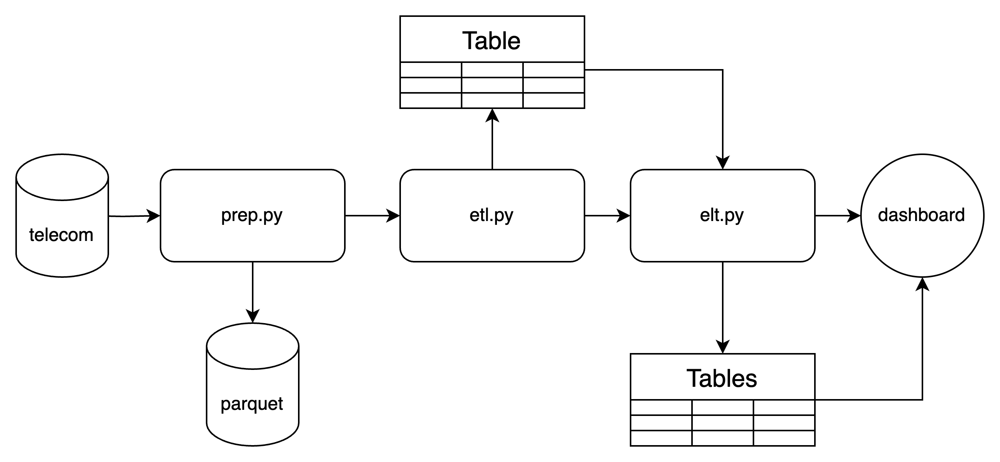

# Bait Telecommunications Service in Mexico :iphone:

## Owners :busts_in_silhouette:
1. Javier Maldonado
2. Pablo Martínez
3. Román Vélez


## Project Overview :mag:
This project aims to create a robust product data architecture to analyze and visualize the geographical distribution of users utilizing "BAIT" telecommunications service in Mexico. The architecture leverages Apache Spark on AWS for an ETL (Extract, Transform, Load) processes, Python for additional ELT (Extract, Load, Transform) operations, and Amazon QuickSight for creating insightful dashboards.



## Project Structure :open_file_folder:
```
.
├── figures/
├── data/
├── etl/
│   ├── scripts.py
├── elt/
│   ├── scripts.py
│   └── requirements.txt
├── README.md
└── LICENSE
```

## Prerequisites :scissors:
- AWS account with access to S3, EMR, and QuickSight
- Python 3.9+

## Setup and Installation :hammer_and_wrench:

### AWS Configuration :cloud:
1. S3 Buckets: Create S3 buckets for raw data, processed data, and output data.
2. EMR Cluster: Set up an EMR cluster configured to run Spark jobs.
3. IAM Roles: Ensure proper IAM roles and policies are in place to allow access to S3, EMR, and QuickSight.

### Local Environment Setup :computer:
1. Clone the repository

   ```bash
   git clone https://github.com/yourusername/bait-telecom-data-architecture.git
   cd bait-telecom-data-architecture
   ```

2. Set up Python environment:
    ```bash
   python -m venv venv
   source venv/bin/activate
   pip install -r elt/requirements.txt
    ```

### ETL Process :arrows_counterclockwise:
#### Spark on AWS
Spark jobs are used to handle the initial stages of the ETL process.

1. Configuration: Update etl/configs/config.json with your S3 bucket details and other configuration parameters.
2. Submit Spark Jobs: Upload the Spark job scripts to S3 and submit the jobs to your EMR cluster.

#### ELT Process
Python scripts are used for additional data transformation and loading processes.

1. Run the ELT scripts to perform additional transformations and load the data into the output S3 bucket. You must download the data from the raw data S3 bucket to your local environment before running the scripts.
   ```bash
   python elt/scripts.py
   ```

### Data Visualization :bar_chart:

Amazon QuickSight is used to create dashboards for visualizing the geographical distribution of users.

## License :page_facing_up:
This project is licensed under the MIT License. See the LICENSE file for details.

For further questions or support, please open an issue in the repository or contact the project maintainer.
